  

  

  

    
    
    
    
  

---

## 🖥️ Developer Workspace

<table width="100%">
<tr>
<td width="60%" valign="middle">

</td>
<td width="40%" align="center" valign="middle">

</td>
</tr>
</table>

 

  

---

## 🛠️ Tech Stack

  

<b>📁 tech-stack</b> <code>(click to collapse / expand)</code>

 

<blockquote>

<b>├── 📂 frontend</b>

 

  

 

<b>├── 📂 frontend-libraries</b>

 

  &nbsp;&nbsp;
  &nbsp;&nbsp;
  

 

<b>├── 📂 backend-frameworks</b>

 

  &nbsp;&nbsp;
  

 

<b>├── 📂 database</b>

 

  &nbsp;&nbsp;
  

 

<b>├── 📂 os</b>

 

  

 

<b>└── 📂 tools-and-ide</b>

 

  

 

</blockquote>

---

## 📊 Live GitHub Analytics

  <table border="0" cellpadding="0" cellspacing="0">
    <tr>
      <td align="center" valign="top">
        
      </td>
      <td align="center" valign="top">
        
      </td>
    </tr>
  </table>

   

  

---

## 🐍 Contribution Snake

  <picture>
    <source media="(prefers-color-scheme: dark)" srcset="https://raw.githubusercontent.com/t1endatj/profile/output/github-snake-dark.svg">
    <source media="(prefers-color-scheme: light)" srcset="https://raw.githubusercontent.com/t1endatj/profile/output/github-snake.svg">
    
  </picture>

---

## 📬 Connect

  
  
  
  

 

  

